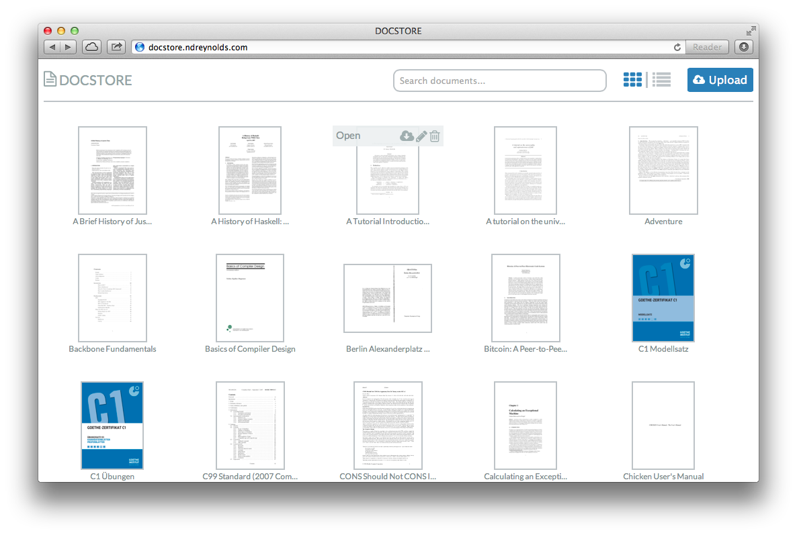
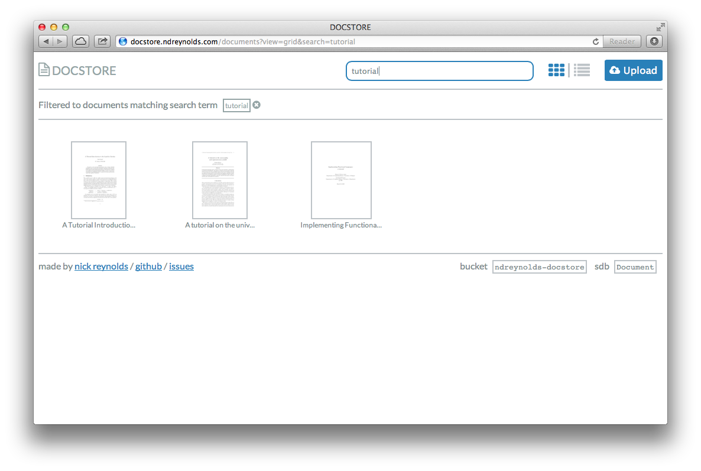

docstore
========

docstore lets you store and manage your documents in the cloud with Amazon S3 &
SimpleDB. 

It comes as a Rails 3 web application. Run it locally, or deploy it (runs fine
on the Heroku free plan, see the guide below).

Installation
------------
Run docstore like any other Rails3 application (`bundle install` and 
`rails server`). See the Heroku deployment guide below for more details.

To run locally, you'll need Imagemagick and Ghostscript installed
(specifically, the `convert` executable).

A few environment variables need to be set in order to authenticate with AWS,
choose the right S3 bucket and SimpleDB domain, and provide basic authentication
for the app:

- `AWS_ACCESS_KEY_ID`: your AWS access key
- `AWS_SECRET_ACCESS_KEY`: your AWS secret access key
- `DOCSTORE_S3_BUCKET_ID`: AWS S3 bucket to hold your documents
- `DOCSTORE_SDB_DOMAIN`: AWS SimpleDB domain to hold document metadata
- `DOCSTORE_USER`: log in with this username over basic auth
- `DOCSTORE_PASS`: log in with this password over basic auth

After exporting the environment variables, you can use `rake simpledb:setup`
and `rake s3:setup` to create the domain and bucket if they do not already
exist.

Deploying your own docstore to Heroku
-------------------------------------

### Prerequisites:

- [AWS][1] account
- [Heroku][2] account and the [Heroku Toolbelt][3]

### Steps

1. Clone the docstore repo to your local machine:

        git clone git://github.com/ndreynolds/docstore.git
        cd docstore

2. Create a [`.env`][4] file in the docstore directory. It should look like the
   one below (but with proper values filled in, of course):

        AWS_ACCESS_KEY_ID=my-access-key
        AWS_SECRET_ACCESS_KEY=my-secret-access-key
        DOCSTORE_S3_BUCKET_ID=my-documents
        DOCSTORE_SDB_DOMAIN=documents
        DOCSTORE_USER=test
        DOCSTORE_PASS=test

   The first two are your Amazon AWS credentials, you can find these under
   [Security Credentials][5] on your AWS account page.

   `DOCSTORE_S3_BUCKET_ID` should be a globally-unique bucket name 
   (e.g. `myusername-docstore`). If it does not already exist, we'll create it
   in step 6.

   `DOCSTORE_SDB_DOMAIN` is a SimpleDB domain name unique to your own SimpleDB
   domains (e.g. `docstore-documents`). If it does not already exist, we'll
   create it in step 6.

   `DOCSTORE_USER` and `DOCSTORE_PASS` are the credentials of your choice that
   you'll use log in (basic authentication).

3. Create a new Heroku app, get the [heroku-config][6] plugin and push your
   `.env` from earlier:

        heroku apps:create my-docstore
        heroku plugins:install git://github.com/ddollar/heroku-config.git
        heroku config:push

5. Push your docstore to Heroku

        git push heroku master

6. Run the rake tasks to create your S3 bucket and SimpleDB domain. If these
   already exist, you can skip this step.

        heroku run rake simpledb:setup
        heroku run rake s3:setup

7. Open your new docstore, log in and start uploading

        heroku apps:open

### Caveats

- With thumbnail generation enabled, uploading large files may cause the Heroku
  dyno to exceed its 512MB memory limit. Despite receiving an error page, the
  upload will probably still succeed. If this becomes a problem, you can upload
  files to a local instance of the app (configured against the same AWS
  services), or increase your dyno size. 

[1]:http://aws.amazon.com
[2]:http://heroku.com
[3]:http://toolbelt.heroku.com
[4]:https://devcenter.heroku.com/articles/config-vars#local-setup
[5]:https://portal.aws.amazon.com/gp/aws/securityCredentials
[6]:https://github.com/ddollar/heroku-config
